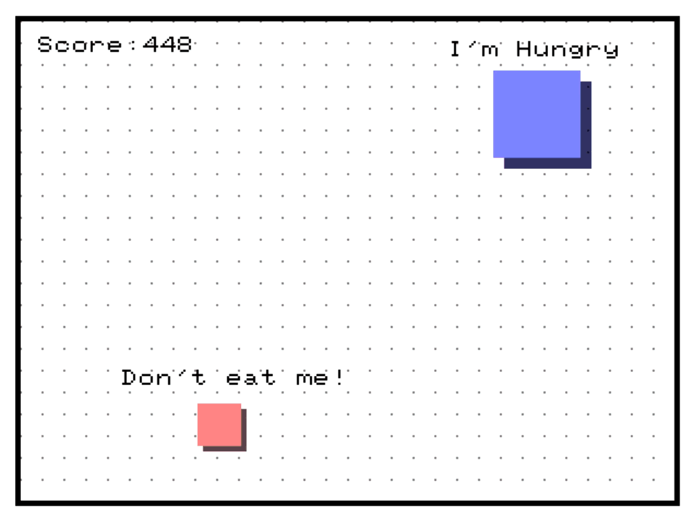
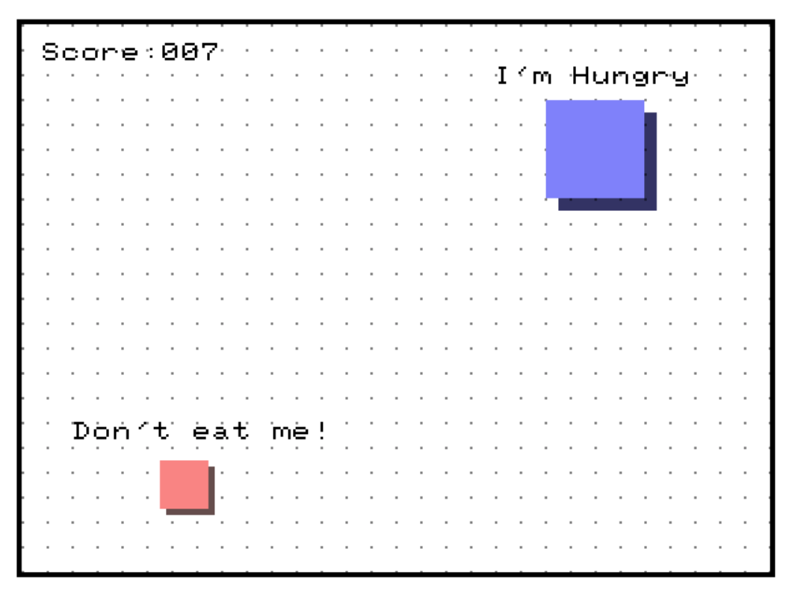
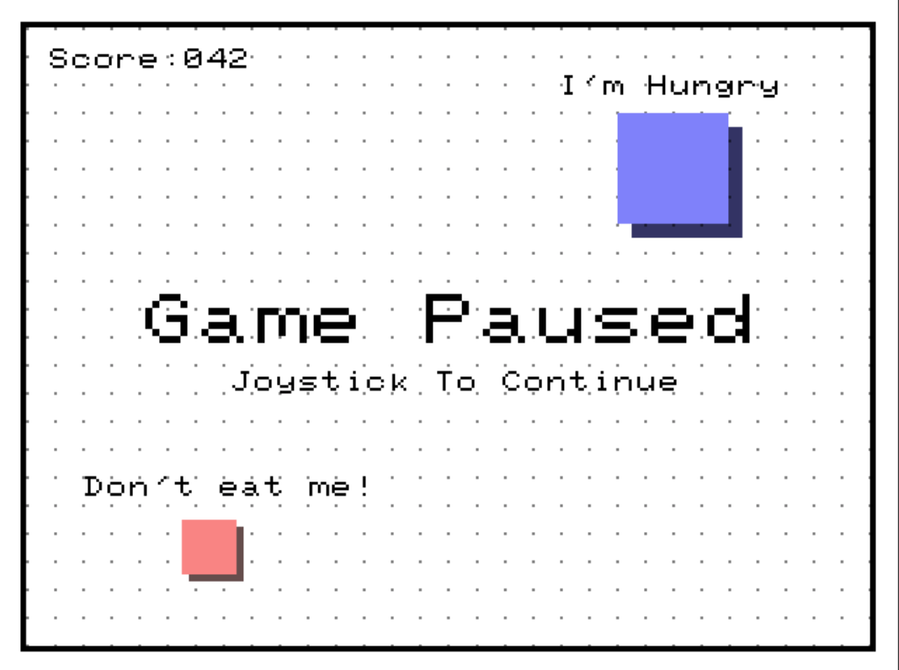
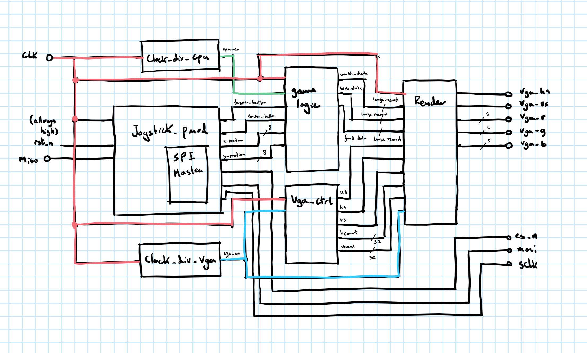

# 🎮 FPGA Cat & Mouse Chase

> An embedded systems game built from scratch on an FPGA board featuring VGA graphics, joystick control, and a custom 8x8 bitmap font system inspired by retro computing!

<p align="center">
  
</p>

## 📖 Overview

Welcome to my embedded systems final project! This is a fully functional **cat and mouse chase game** implemented entirely in **VHDL** on an FPGA development board. Play as the blue cat chasing the red mouse across a retro-style grid, score points, and enjoy the satisfying pixel-perfect gameplay.

### ✨ Key Features

- 🎯 **Joystick Control** - Navigate using a physical joystick PMOD module
- 📺 **VGA Output** - Real-time 640x480 graphics rendered directly to a monitor
- 🔤 **Custom Bitmap Font System** - 8x8 pixel font inspired by the legendary Commodore 64
- 🎨 **Shader Preview Pipeline** - GLSL shader preview for rapid prototyping
- 🏆 **Score Tracking** - Dynamic score display that updates in real-time
- ⏸️ **Pause/Resume** - Full game state management with pause functionality

## 🎬 Gameplay

|          Start Screen          |           In-Game Action           |              Paused              |
| :----------------------------: | :--------------------------------: | :------------------------------: |
|  |  |  |

### 🕹️ How to Play

1. **Start the Game** - Press the center button on the joystick to begin
2. **Chase the Mouse** - Use the joystick to move your blue cat around the screen
3. **Catch & Score** - Touch the red mouse to eat it and earn points
4. **Keep Going** - The mouse respawns at a random location after each catch
5. **Pause Anytime** - Press the trigger button to pause, center button to resume


## 🏗️ Architecture

<p align="center">
  
</p>

### System Components

| Module                                       | Description                                           |
| -------------------------------------------- | ----------------------------------------------------- |
| [`top.vhd`](src/top.vhd)                     | Top-level entity connecting all modules               |
| [`game_logic.vhd`](src/game_logic.vhd)       | Core game state machine, collision detection, scoring |
| [`render.vhd`](src/render.vhd)               | Pixel-by-pixel VGA rendering engine with font system  |
| [`vga_ctrl.vhd`](src/vga_ctrl.vhd)           | VGA timing controller (640x480 @ 60Hz)                |
| [`pmod_joystick.vhd`](src/pmod_joystick.vhd) | SPI interface for joystick PMOD input                 |
| [`spi_master.vhd`](src/spi_master.vhd)       | SPI communication protocol handler                    |
| [`clock_div_cpu.vhd`](src/clock_div_cpu.vhd) | Clock divider for game logic                          |
| [`clock_div_vga.vhd`](src/clock_div_vga.vhd) | Clock divider for VGA timing                          |
| [`game_package.vhd`](src/game_package.vhd)   | Shared types, records, and utility functions          |

## 🔤 The Font System: Retro Computing Meets FPGA

One of the coolest parts of this project is the **custom bitmap font rendering system**!

### How It Works

1. **Font Source** - I used a classic 8x8 pixel font (inspired by the Commodore 64 computer system)

<p align="center">
  
</p>

2. **Font Conversion** - Python scripts convert the bitmap image into VHDL-compatible arrays:
   - [`img_to_vhdl.py`](font/img_to_vhdl.py) - Converts PNG font image to std_logic arrays
   - [`text_to_ascii.py`](font/text_to_ascii.py) - Converts strings to ASCII arrays for rendering

3. **Hardware Rendering** - The [`render.vhd`](src/render.vhd) module implements character lookup and string drawing functions in pure hardware!

```vhdl
-- Font lookup from 8x8 bitmap (96 characters)
type font_type is array(0 to 7, 0 to 767) of std_logic;

-- Functions to draw text on screen
function draw_char(...) return std_logic;
function draw_string(...) return std_logic;
```

### Text Rendering Features

- **Dynamic Positioning** - Text follows game objects ("I'm Hungry" above the cat, "Don't eat me!" above the mouse)
- **Live Score Updates** - Score digits calculated and rendered in real-time
- **Scaling Support** - Text can be rendered at different sizes (2x, 5x, etc.)

## 🎨 Shader Preview Pipeline

Before implementing in VHDL, I built a **GLSL shader preview** to rapidly iterate on the visual design!

<p align="center">
  
</p>

The [`shader/preview.fs`](shader/preview.fs) file contains the complete Fragment Shader that mirrors the VHDL implementation. This approach allowed me to:

- ✅ Test color palettes and visual effects instantly
- ✅ Verify game mechanics before hardware synthesis
- ✅ Perfect the font rendering algorithm
- ✅ Share animated previews with others

## 🔌 Hardware Setup

<p align="center">
  
</p>

### Required Hardware

| Component         | Details                                                                 |
| ----------------- | ----------------------------------------------------------------------- |
| **FPGA Board**    | Digilent Zybo Z7: Zynq-7000 ARM/FPGA SoC Development Board (Zybo Z7-10) |
| **PMOD Joystick** | Digilent PmodJSTK or compatible SPI joystick module                     |
| **VGA Monitor**   | Standard VGA display supporting 640x480 resolution                      |
| **VGA Cable**     | To connect FPGA to monitor                                              |

### Pin Connections

| Signal       | Direction | Description                        |
| ------------ | --------- | ---------------------------------- |
| `vga_r[4:0]` | Output    | 5-bit Red color channel            |
| `vga_g[5:0]` | Output    | 6-bit Green color channel          |
| `vga_b[4:0]` | Output    | 5-bit Blue color channel           |
| `vga_hs`     | Output    | Horizontal sync                    |
| `vga_vs`     | Output    | Vertical sync                      |
| `miso`       | Input     | SPI Master In Slave Out (joystick) |
| `mosi`       | Output    | SPI Master Out Slave In (joystick) |
| `sclk`       | Output    | SPI Clock                          |
| `cs_n`       | Output    | SPI Chip Select (active low)       |

## 🚀 Getting Started

### Prerequisites

- Vivado (Xilinx FPGA design software) or equivalent VHDL toolchain
- FPGA development board with VGA output
- PMOD joystick module
- VGA-compatible monitor

### Build & Deploy

1. **Clone the repository**
   ```bash
   git clone https://github.com/RonikKapadia/embedded-cat-mouse.git
   cd embedded-cat-mouse
   ```

2. **Open in Vivado**
   - Create a new project
   - Add all `.vhd` files from the `src/` directory
   - Set `top.vhd` as the top-level entity

3. **Configure Pin Assignments**
   - Assign pins according to your FPGA board's VGA and PMOD pinout
   - Check your board's documentation for specific pin mappings

4. **Compile & Program**
   - Run Analysis & Synthesis
   - Run Fitter
   - Generate bitstream
   - Program the FPGA

5. **Connect & Play!**
   - Connect VGA cable to monitor
   - Connect PMOD joystick
   - Power on and enjoy!

## 📁 Project Structure

```
embedded-cat-mouse/
├── 📂 assets/              # Screenshots and documentation images
│   ├── BlockDiagram.png    # Hand-drawn system architecture
│   ├── StartGame.png       # Start screen screenshot
│   ├── RunningGame.png     # Gameplay screenshot
│   ├── GamePaused.png      # Pause screen screenshot
│   ├── SystemSetupIRL.png  # Real hardware setup photo
│   └── Preview.gif         # Animated shader preview
├── 📂 src/                 # VHDL source files
│   ├── top.vhd             # Top-level module
│   ├── game_logic.vhd      # Game state & logic
│   ├── render.vhd          # VGA rendering engine
│   ├── vga_ctrl.vhd        # VGA timing controller
│   ├── pmod_joystick.vhd   # Joystick interface
│   ├── spi_master.vhd      # SPI communication
│   ├── clock_div_*.vhd     # Clock dividers
│   ├── game_package.vhd    # Shared types/functions
│   └── *_tb.vhd            # Testbenches
├── 📂 font/                # Font conversion tools
│   ├── font.png            # Source bitmap font
│   ├── img_to_vhdl.py      # PNG → VHDL converter
│   └── text_to_ascii.py    # String → ASCII converter
├── 📂 shader/              # GLSL shader preview
│   ├── preview.fs          # Fragment shader
│   └── font.png            # Font texture for shader
└── README.md               # This file!
```

## 🧠 Technical Highlights

### Game State Machine

The game uses a 3-state finite state machine implemented in [`game_logic.vhd`](src/game_logic.vhd):

```vhdl
type game_state is (start_game, running, pause_game);
```

### Collision Detection

Pixel-perfect AABB (Axis-Aligned Bounding Box) collision detection:

```vhdl
-- Eat food when cat overlaps mouse
if ((blob.x + blob.size) >= (food.x + food.size)) and
   ((blob.x - blob.size) <= (food.x - food.size)) and
   ((blob.y + blob.size) >= (food.y + food.size)) and
   ((blob.y - blob.size) <= (food.y - food.size)) then
    -- Respawn food at random position
    food.x <= (rand mod (world.bnd_x-(2*food.size))) + food.size;
    food.y <= (rand mod (world.bnd_y-(2*food.size))) + food.size;
    world.score <= world.score + 1;
end if;
```

### VGA Timing

Standard 640x480 @ 60Hz VGA timing with precise horizontal and vertical sync signals.

## 🙏 Credits & Acknowledgments

- **Font**: Inspired by the iconic Commodore 64 8x8 character set
- **PMOD Driver**: Based on open-source SPI joystick interface
- **Shader Preview**: Built with Shadertoy-compatible GLSL

## 📄 License

This project is open-source and available for educational purposes. Feel free to fork, modify, and build upon it!
